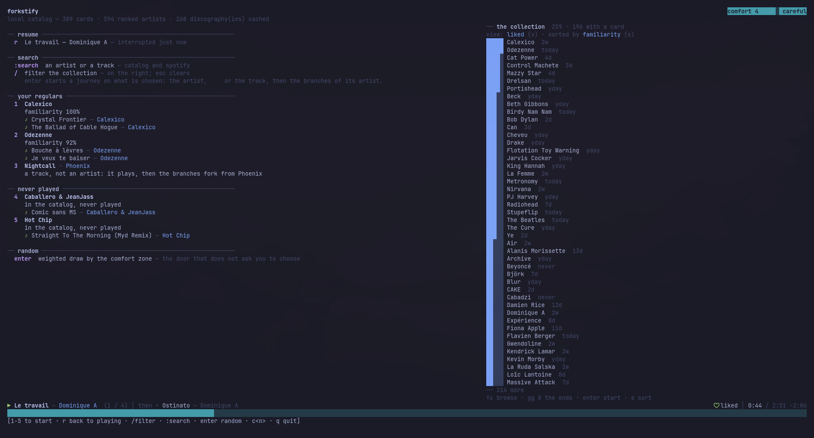
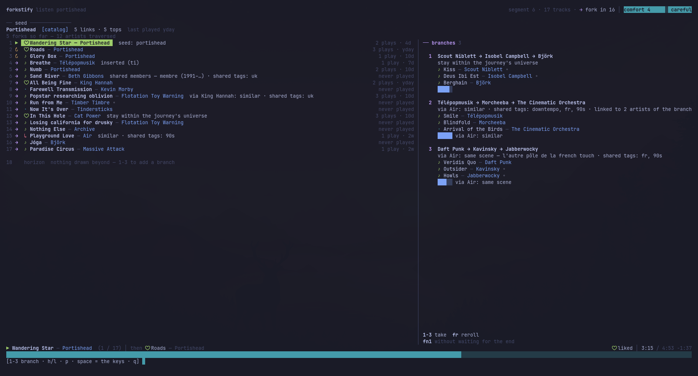
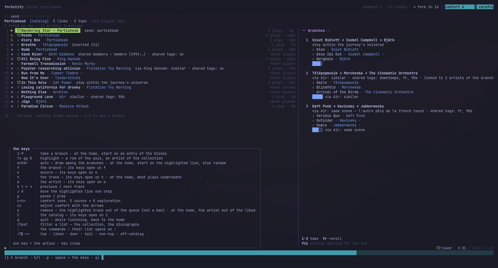
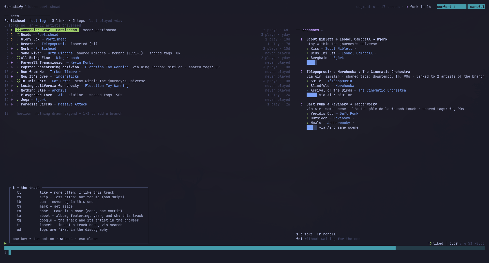
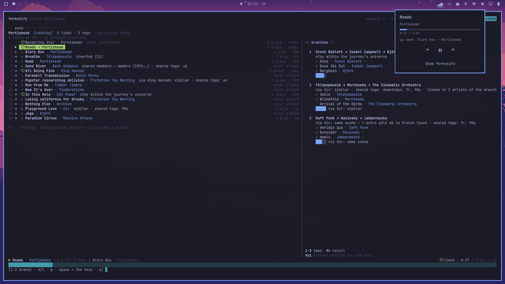
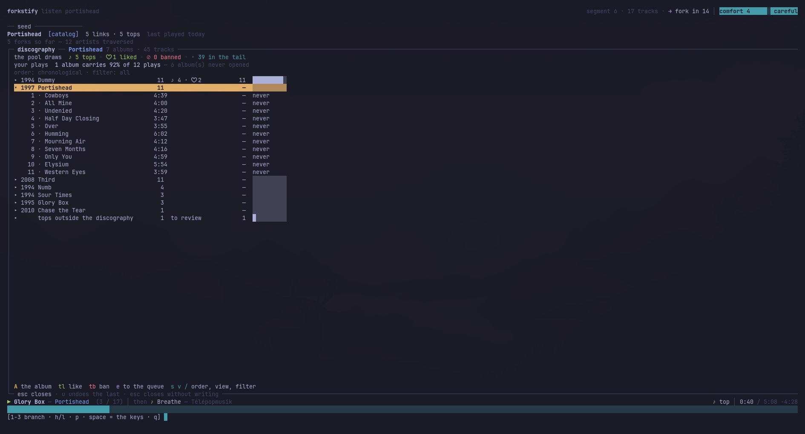
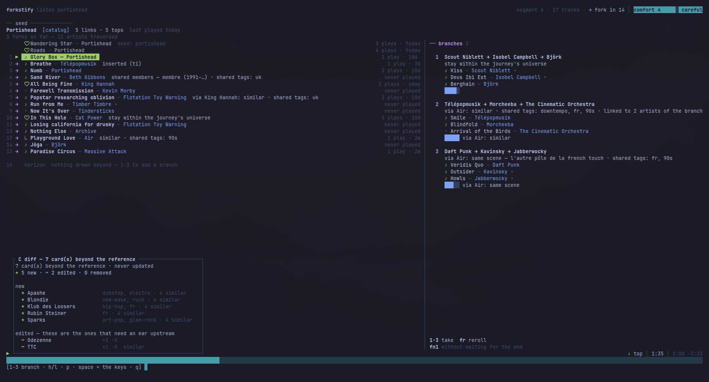

# A tour of the screens

Seven screenshots, taken on 2026-09-25 on Omarchy, in the order a session
goes through them. The words used here are the ones of
[`vision.md`](vision.md); the keys are the ones of
[`keybindings.md`](keybindings.md).

## Home

What `forkstify` opens on. The left column is the doors in: resume what was
interrupted, search the catalog and Spotify, **your regulars** with their
familiarity, artists in the catalog you **never played**, and `⏎` for a
weighted draw by the comfort zone. The right column is the **collection**
— the liked, sorted by familiarity, the bar on the left of each row being
how well the engine knows you know them. `/` filters it, `⏎` on a row
starts a journey there.

## Listening

The heart of the product. Top left, the **seed** the journey started from.
Below, the **axis**: what has played and what is queued, one line per
track, each one with its reason in grey — *shared members*, *via King
Hannah: similar*, *stay within the journey's universe*, *inserted*. On the
right, the three **branches** proposed for the next fork: a chain of three
artists, the reason for the chain, and the tracks it would bring. The
header says when the fork comes and where the comfort dial sits. `1`–`3`
takes a branch, `⏎` lets the engine choose, `fr` rerolls.

## The keys

Space is the leader. Pressed on its own it lists everything you can type;
one key on the list performs the action. The four lowercase namespaces are
there — `f` the branch, `e` encore, `t` the track, `a` the artist — plus
`C` the catalog, the comfort dial and the commands.

Typing a namespace opens its own table, here `t`: `tl` more often, `ts`
less often, `tb` never again, `ta` what this track is and why it is here.
`⌫` goes one level up, `esc` closes.

## The bar widget

The repository is an Omarchy plugin
([0021](decisions/0021-the-repository-is-the-omarchy-plugin.md)). The
widget in the bar reads the player's MPRIS metadata: the track, the
artist, the progress, **up next**, the transport buttons, and a button to
bring the terminal forward.

## The discography

`ad` on an artist. The albums, chronological, each with its track count,
its liked and its plays; one unfolded to its tracks. Above, what the
engine's **pool** draws from for this artist — the tops, the liked, the
banned, and the long tail that only weighs as comfort opens up — and
where your plays actually went. `A` promotes an album, `tl` and `tb` work
on a track, `e` queues it.

## What the fork holds

`Cd`. The cards this catalog carries that the reference does not: the
**new** ones, generated on the fly when a journey arrived at an artist
without a card, with their tags and links; and the **edited** ones, with
what changed. This is what `Cp` would propose upstream as one pull request
([0025](decisions/0025-the-review-is-the-pull-request.md)).
